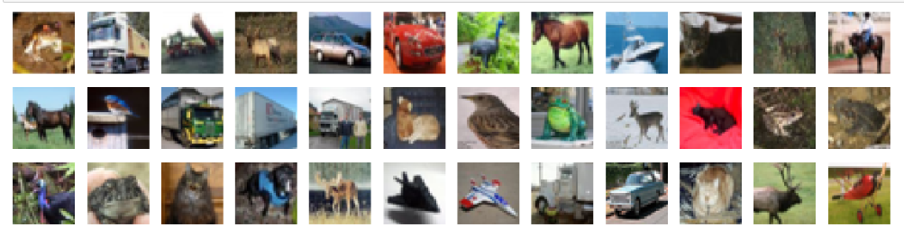

# Deep learning images classification project
## using Convolutional Neural Networks (CNN):
### cifar_10-dataset-image-classification
In this notebook, we train a CNN on augmented images from the CIFAR-10 database and get accuracy 88.3%
45000 train samples
10000 test samples
5000 validation samples
I used google colab gpu to train the CNN

### Here is sample of training images:

### Here is sample of classified images with 88.3% acc:

